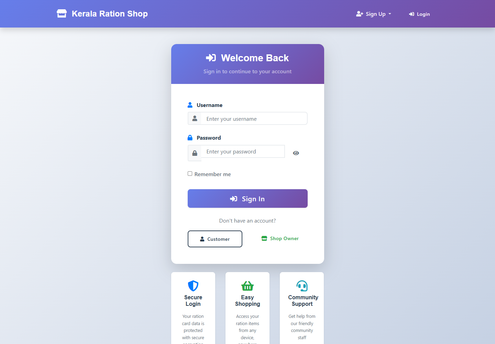
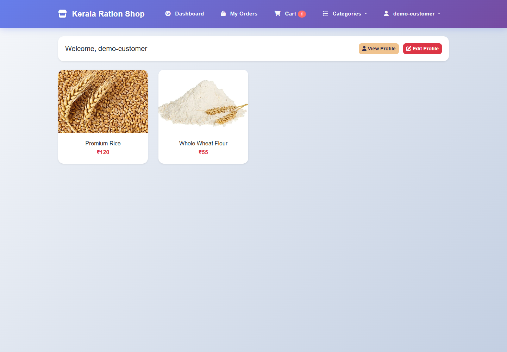
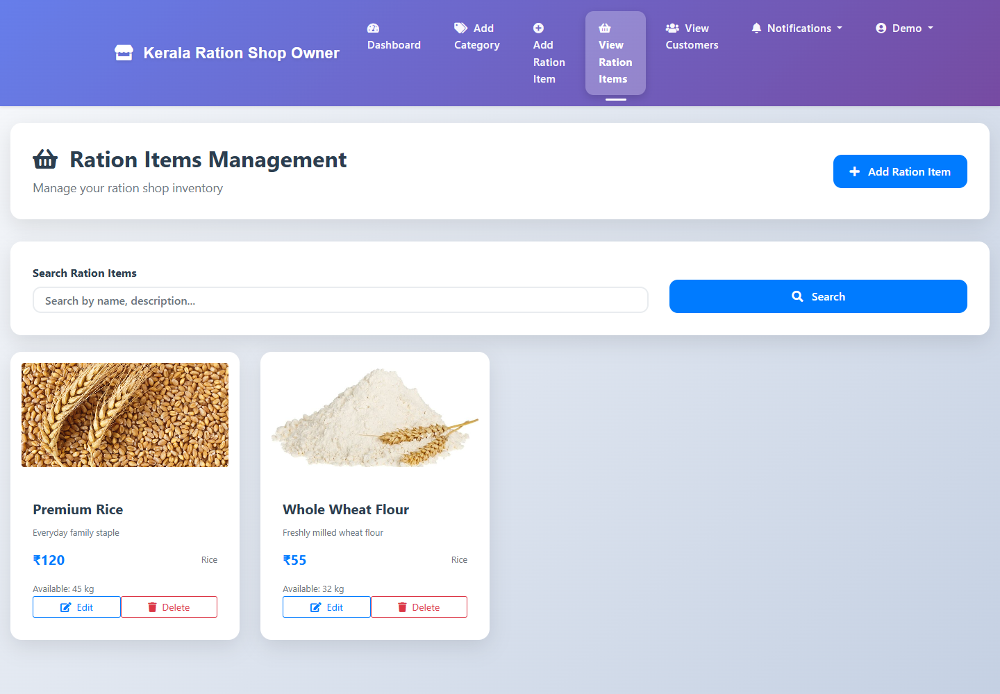
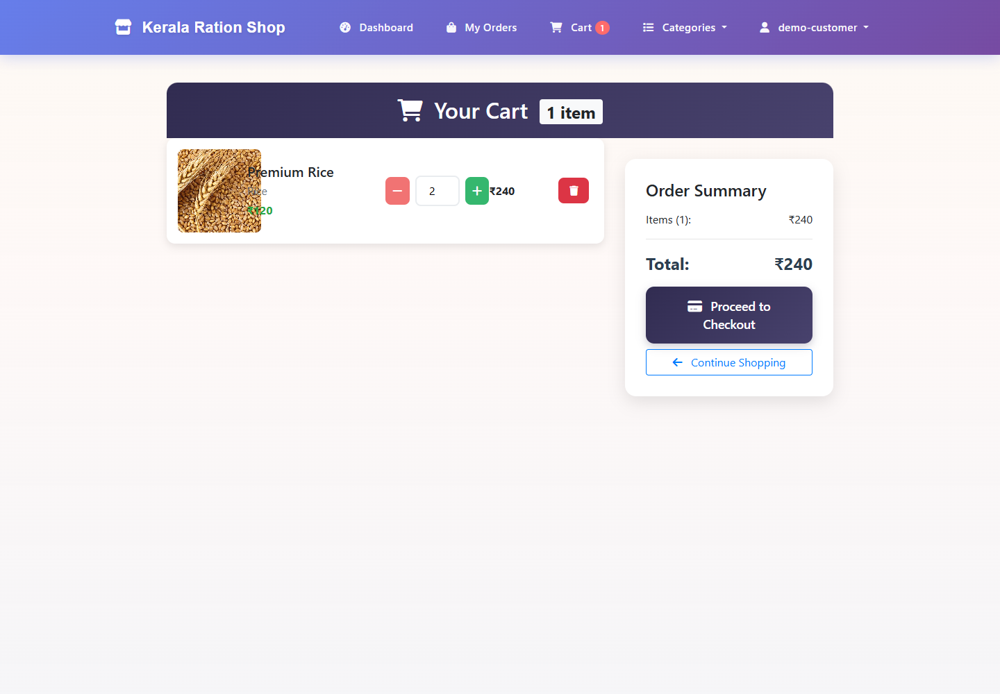
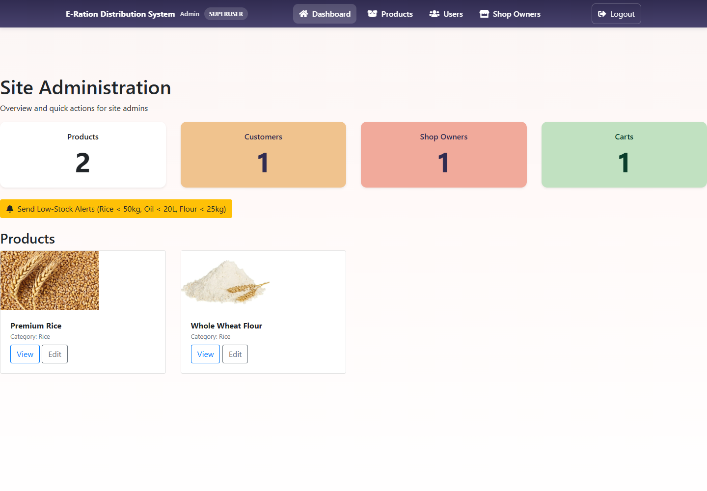

# E-Ration Distribution System

## Overview

A Django-based e-ration and grocery distribution system with customer authentication, product and stock management, shopping cart, order management, and administration for shop owners and site administrators.

## Features

- Customer registration, authentication, and profile management
- Ration and grocery product catalog with inventory tracking
- Shopping cart and checkout
- Order placement, history, and management
- Shop-owner dashboard for products and customer orders
- Django Admin and site-administrator tools
- SQLite database for local development

## Technology Stack

- Python and Django
- SQLite
- HTML, CSS, and JavaScript
- Bootstrap and Font Awesome

## Screenshots

### Home


### Login



### Customer Dashboard



### Product and Stock Management



### Cart and Orders



### Admin and Reporting



Screenshots use fictional demo accounts and sample products.

## Project Structure

```text
.
├── E_Ration/                 # Existing Git submodule
├── ration/
│   ├── ecom/                 # Django project settings and URL configuration
│   ├── ecomapp/              # Application models, views, forms, and migrations
│   ├── media/                # Local product uploads and user uploads
│   ├── scripts/              # Project scripts
│   ├── static/               # CSS and static images
│   ├── templates/            # Django templates
│   ├── tools/                # Development and maintenance utilities
│   └── manage.py
├── screenshots/              # README screenshots
├── .gitignore
└── README.md
```

## Installation

1. Install Python 3.10 or later.
2. From the repository root, enter the Django project and create a virtual environment:

   ```powershell
   cd ration
   python -m venv venv
   .\venv\Scripts\Activate.ps1
   ```

3. Install Django:

   ```powershell
   python -m pip install "Django>=5.2,<5.3"
   ```

4. Set a secret key for the current PowerShell session:

   ```powershell
   $env:DJANGO_SECRET_KEY = python -c "from django.core.management.utils import get_random_secret_key; print(get_random_secret_key())"
   ```

   Set `DJANGO_SECRET_KEY` through your deployment environment in production. Do not commit `.env` files or production secrets.

## How to Run

With the virtual environment activated and `DJANGO_SECRET_KEY` set, run:

```powershell
python manage.py migrate
python manage.py createsuperuser
python manage.py runserver
```

Open <http://127.0.0.1:8000/> for the application. Django Admin is available at <http://127.0.0.1:8000/admin/>.

## What I Learned

- Building multi-role authentication and permissions with Django
- Modeling customers, products, inventory, carts, and orders with the Django ORM
- Connecting templates and static assets to database-backed views
- Using migrations and Django Admin to maintain application data
