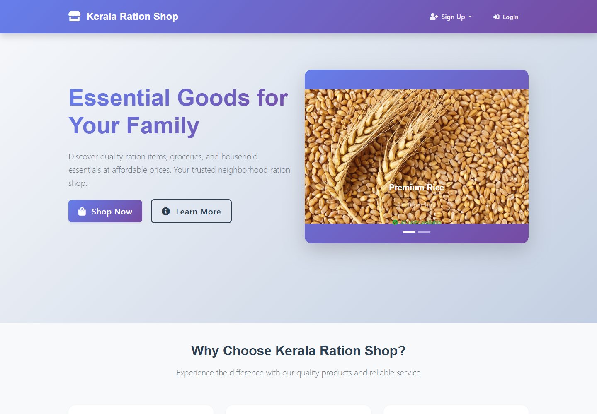

E_Ration


# 🛒 Kerala Ration Shop

A modern and user-friendly **online ration shop and grocery e-commerce website** developed using **Django**.

The application allows customers to explore essential ration items, groceries, and household products, create customer accounts, and shop conveniently through an attractive web interface.

---

## 📸 Project Screenshots

### 🏠 Home Page

The home page provides a clean and modern landing page for the Kerala Ration Shop, with navigation, promotional content, and quick access to shopping.



---

### ⭐ Why Choose Kerala Ration Shop

The website highlights important services such as:

- Quality Assurance
- Home Delivery
- Community Service
- Affordable essential products
- Reliable customer service


---

### 👤 Customer Registration

Customers can create an account by providing their personal information and joining the Kerala Ration Shop.


---

### 💻 Project Structure

The project is developed using Django with separate applications, templates, static files, media files, and database management.


---

## 🚀 Features

- 🛍️ Online ration and grocery shopping
- 👤 Customer account registration
- 🔐 User authentication
- 📦 Product management
- 🛒 Shopping cart functionality
- 💳 Order management
- 🚚 Home delivery information
- 📱 Responsive user interface
- 🎨 Modern and attractive design
- 🏪 Admin management through Django Admin
- 🗄️ SQLite database support

---

## 🛠️ Technologies Used

### Frontend

- HTML5
- CSS3
- JavaScript
- Responsive Web Design

### Backend

- Python
- Django

### Database

- SQLite3

### Development Tools

- Visual Studio Code
- Git
- GitHub

---

## 📂 Project Structure

```text
ration/
│
├── ecomapp/
│   ├── migrations/
│   ├── templatetags/
│   ├── __init__.py
│   ├── admin.py
│   ├── apps.py
│   ├── context_processors.py
│   ├── forms.py
│   ├── models.py
│   ├── tests.py
│   ├── urls.py
│   ├── utils.py
│   └── views.py
│
├── media/
├── scripts/
├── static/
├── templates/
├── tools/
├── venv/
│
├── .gitignore
├── db.sqlite3
├── manage.py
└── README.md

2. Navigate to the project directory
cd ration

3. Create a virtual environment
python -m venv venv

4. Activate the virtual environment
Windows PowerShell
venv\Scripts\Activate.ps1

Windows Command Prompt
venv\Scripts\activate

5. Install dependencies
If a requirements.txt file is available:

pip install -r requirements.txt

Otherwise install Django:

pip install django

6. Apply database migrations
python manage.py migrate

7. Create an admin user
python manage.py createsuperuser

Follow the instructions to create your administrator account.

8. Run the development server
python manage.py runserver

Open the application in your browser:

http://127.0.0.1:8000/

👨‍💼 Admin Panel
Django Admin can be accessed through:

http://127.0.0.1:8000/admin/

The administrator can manage products, customers, orders, and other application data through the Django administration interface.

Purpose of the Project
The purpose of this project is to provide a simple and convenient online platform for purchasing:

Ration products
Groceries
Household essentials
Daily-use products
The project demonstrates how Django can be used to build a complete e-commerce-style web application with customer management, product management, and order-related functionality.

🌟 Future Improvements
Some possible improvements for future versions include:

Online payment gateway integration
Order tracking
Product reviews and ratings
Wishlist functionality
Email notifications
SMS notifications
Advanced product search
Product filtering
Delivery tracking
Customer order history
Deployment to a production server
📌 Project Status
Status: Completed / Under Development

The project is actively being improved with additional features and UI enhancements.

👨‍💻 Developer
Developed using Python and Django.

📄 License
This project is created for educational and development purposes.


## 3. Very important — upload the screenshots

In VS Code, create:

```text
screenshots

Then put your four images inside it.

Your README references them like this:


GitHub will automatically display the image when the file exists at that location.

4. Then push everything to GitHub
From your current terminal:

git add .
git commit -m "Add project README and screenshots"
git push

You should see something similar to:

Writing objects...
To github.com:...
   master -> master

Then refresh your GitHub repository. Your README will appear on the repository's front page with the screenshots.

One small recommendation
I would not upload venv/ or db.sqlite3 to GitHub for a professional project. Your .gitignore should normally include:

venv/
__pycache__/
*.pyc
db.sqlite3
.env

Project Name: E-Ration – Smart Ration Distribution System

Repository: E_Ration

Purpose: Academic / Project Development

 
